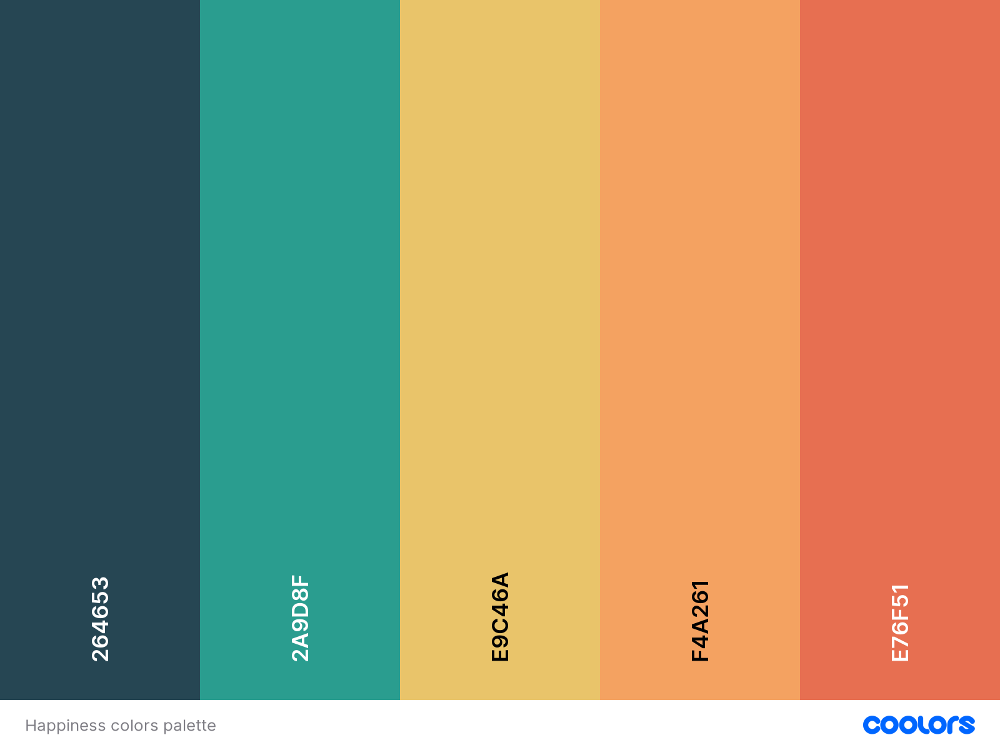

# **HAPPY HACKS - Introduction**

## ***Are you feeling in need of some happiness?***

> "*Even a happy life cannot be without a measure of darkness, and the word ‘happy’ would lose its meaning if it were not balanced by sadness. It is far better to take things as they come along with patience and equanimity*".
> 
> Carl Jung

So why not welcome youself to our *World Happiness Day Hackathon project*, also know as **Happy Hacks**? - a rejoiceful place, full of fun emojis and happy ideas for the world!

HAPPY HACKS is a place where users can receive inspirational '**Happy Hacks**', that they can use to motivate and guide themselves towards happiness, with advice from others. The home page invites users to click a button to receive a random 'hack', generated by other users. Users can create their own hacks by completing a form and attach an emoji to the post, sharing their own tips for the benefit of others. Hacks can be liked and the text and assciated emojis assist users in being able to filter posts for themed suggestions that are relevant to them.

View live website here: [Happy Hacks](https://happiness-generator-c0a5ad8756d8.herokuapp.com/).

## Happy Hacks Team Goal

- To create a site around the theme of 'happiness'
- To allow users to share personal experience about how they keep happy
- To provide users with suggestions of how to keep happy
- To incorporate css frameworks, such as bootstrap
- To use images, colours, emoticons and sounds to create a happy feel
- To build an interactive site using DJANGO with CRUD functionality
- To provide all team members with an opportunity to contribute

## **DESIGN**

### **Colours**
- Research indicated that the happiest colour was yellow, with oranges also featuring.
- We selected a palette of complimentary colours with a happy theme.
- Colours were selected using the coolors color palette generator.  

### **Typography**
- The fonts used throughout the site were selected from Google Fonts.
- Fonts were selected for their simple and readable design to avoid distracting from the content.
- Roboto Slab and Quicksand were selected.
- Later, Lilita One, was selected for the home page title for impact.
- All fonts were sourced through [Google fonts](https://fonts.google.com/).

### **Media**
- [Balsamiq](https://balsamiq.com/) was used for the design of wireframes.
- [Fontawesome](https://fontawesome.com/) was used for the icons on the home page and the attending and comment icons on the Event Details Page.
- [DrawSQL](https://drawsql.app/) was used to sketch out the database models at an early stage.

### **Wireframes**
Wireframes for different views are linked here:

### **Database Schema**

- The database scheme was completed an an early stage, but later ammended to include emoji's

## Features
### Home
   
   * Represent the homepage. The first page that a user see when they log in into the website, and also a page where users can see recently added post from the <strong> Add post </strong> section

### Add Post
   
   * This section has <strong>Title</strong> and <strong>Emoji</strong> input. It require's you to express how you feel at the moment with a title and emoji.

### About
   
   * This section represent the creators of this site, a group of people called <strong>Happy Hacks Team.</strong> In this section you can view the images and names of all creators

### Sign Up
   
   * As a new a new user, signing up might be the best option for you to have yourself registered as a user.

### Login
   
   * A sign in page to always have you log in back to the website with your correct and valid credentials in case maybe you got yourself mistakenly log out

## Technologies Used
   * DJANGO
   * HTML
   * CSS
